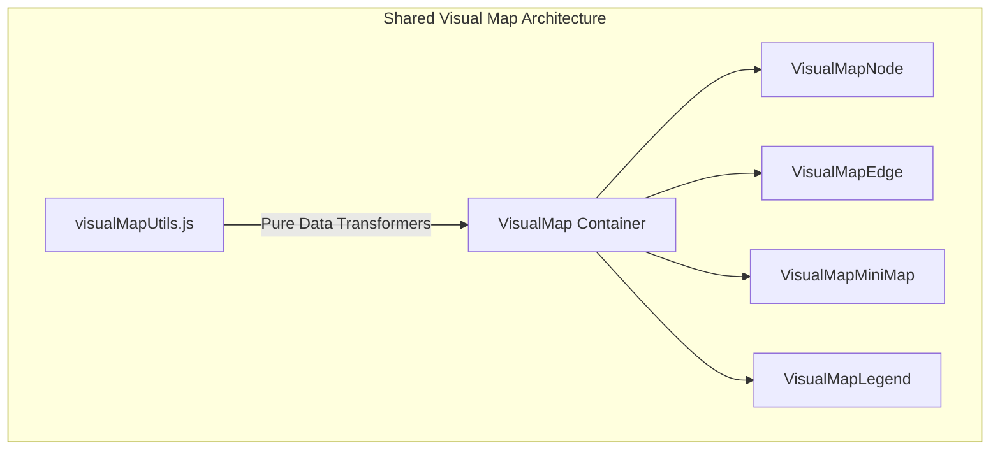
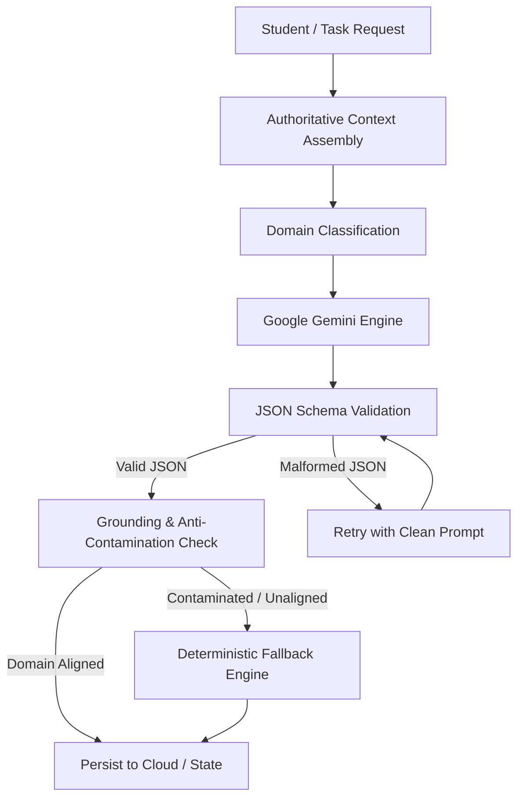
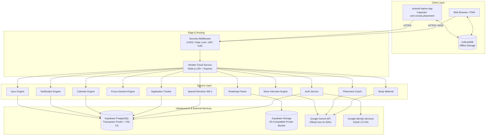

# NOVARA

### AI-Powered Placement Preparation Platform

> Turn your placement roadmap into an adaptive preparation system.

NOVARA is a full-stack placement readiness platform that bridges the gap between curriculum planning and career execution. Instead of scattering study roadmaps, practice problems, flashcards, mock interviews, and application tracking across disconnected tools, NOVARA unifies the entire preparation journey into a single context-aware, offline-capable environment. Powered by Google Gemini and backed by strict pedagogical grounding, NOVARA transforms static syllabus documents into personalized daily missions, deep study guides, spaced revision schedules, and diagnostic placement coaching.

[](https://react.dev/)
[](https://vitejs.dev/)
[](https://nodejs.org/)
[](https://supabase.com/)
[](https://aistudio.google.com/)
[](https://capacitorjs.com/)
[](https://web.dev/progressive-web-apps/)
[]()

[Live Demo](https://novara-qzce.onrender.com) • [Android App ID: com.novara.placement](android/) • [Architecture](#system-architecture)

> NOVARA connects learning, execution, revision, interviews, applications, and placement readiness into one continuous preparation journey.

---

## Product Snapshot

### The Problem

Computer science students and placement aspirants face extreme fragmentation across the preparation lifecycle:
- **Curriculum Planning**: Scattered across static PDFs, Notion templates, or college syllabus sheets.
- **Conceptual Study**: Disjointed across search engines, textbooks, and scattered cheat sheets.
- **Deep Execution**: Fragmented focus sprints tracked on mobile stopwatch apps without task context.
- **Knowledge Decay**: Coding concepts and system design patterns forgotten within 14 days due to lack of systematic recall.
- **Interview Readiness**: Disconnected mock interviews without visibility into individual syllabus strengths or weak spots.
- **Application Funnels**: Job applications, technical rounds, and interview deadlines logged in separate spreadsheets.

### The Solution: A Unified Preparation Engine

NOVARA provides an end-to-end preparation continuum where each phase directly informs and reinforces the next:


Every action updates a single shared state model. When you master a topic in a Focus Sprint, it automatically populates your Spaced Revision queue, feeds your Placement Coach diagnostic benchmark, informs your Mock Interview focus areas, and updates your cross-feature Visual Map.

---

## Feature Showcase

| Domain | Capability | Actual Behavior in NOVARA |
| :--- | :--- | :--- |
| **Learn** | **Roadmap Ingestion** | Upload unstructured roadmaps in PDF, DOCX, Markdown, or plain text with automatic hierarchy extraction. |
| | **Curriculum Parser** | Extracts verified 6-phase curriculum milestones with zero metadata pollution or consolidation bugs. |
| | **Deep Study Mode** | Generates comprehensive study masterclasses with analogies, formal definitions, and formula recurrences. |
| | **Visual Study Diagrams** | Renders contextual ASCII and flow diagrams directly under study document headers. |
| | **Interactive AI Tutor** | "Ask NOVARA" provides grounded actions (`explain_simpler`, `another_example`, `practice_problem`, `step_by_step`, `explain_code`). |
| **Practice** | **Focus Sprint Engine** | Timed Pomodoro/stopwatch workspace with persistent mini-player, background timer persistence, and audio cues. |
| | **Task-Based Quizzes** | 5-question multiple choice quizzes strictly grounded in the completed task concept with server-side scoring. |
| | **Spaced Revision (SM-2)** | SuperMemo-2 spaced recall engine with dynamic retention scoring, optimal interval calculation, and decay tracking. |
| **Prepare** | **Placement Coach** | AI diagnostic benchmark evaluating category mastery, daily pacing status, weak spot shifts, and next best actions. |
| | **AI Mock Interviews** | Domain-specific timed mock technical and behavioral screens with STAR method evaluation and audio transcription. |
| | **Readiness Analytics** | Real-time percent readiness scoring based on curriculum coverage, revision health, and interview performance. |
| **Execute** | **Application Tracker** | Visual pipeline (`Saved → Applied → Assessment → Interview → Offer`) with interview timelines and offer metrics. |
| | **Placement Calendar** | Interactive day-flow timeline showing scheduled sprints, mock interviews, and automated conflict warnings. |
| | **Smart Notifications** | Proactive alert drawer for overdue revisions, upcoming rounds, and streak protections with deep-link navigation. |
| **Platform** | **Authentication** | Dual-mode authentication via email/password (Salted PBKDF2-HMAC-SHA512) and official Google OAuth 2.0 Web GIS. |
| | **Offline-First Storage** | Client-side IndexedDB with operation queue, automatic reconnect batch sync, and idempotency guarantees. |
| | **Cross-Platform** | Single codebase responsive across Mobile, Tablet, Desktop, Installable PWA, and Native Android (Capacitor). |
| | **Design System** | Mindful warm cream, terracotta, and dark obsidian aesthetic with Light, Dark, and System theme synchronizer. |
| | **Visual Map System** | Reusable, accessible graph layer mapping curriculum, tasks, memory decay, readiness, and application progress. |

---

## The NOVARA Experience

A student's end-to-end journey through NOVARA operates across 13 connected milestones:

```
01 — Define the Goal      Target Role (e.g. SDE I), daily capacity (e.g. 3h), target placement date.
02 — Upload Roadmap       Ingest campus placement syllabus or customized pathway via PDF/DOCX/MD.
03 — Review Curriculum    Inspect extracted phases and topics in hierarchical list or Visual Map view.
04 — Daily Mission        AI planner allocates daily tasks balancing new curriculum with due revisions.
05 — Start Focus          Launch a timed focus sprint with distraction-free workspace and notes.
06 — Study with AI        Read the generated Deep Study Guide and query the grounded "Ask NOVARA" tutor.
07 — Complete Quiz        Validate conceptual mastery with a 5-question quiz scored by the server.
08 — Spaced Repetition    Topic enters SM-2 ladder; schedules spaced recall sessions (1d, 3d, 7d, 14d, 30d).
09 — Coach Diagnostics    Placement Coach recalculates readiness score, identifies weak areas, and shifts study capacity.
10 — Mock Interview       Practice timed technical screens tailored to weak topics with instant STAR feedback.
11 — Track Applications   Log company applications, schedule interview rounds, and monitor pipeline progress.
12 — Manage Deadlines     Review calendar day-flow timeline to detect interview conflicts and study sprints.
13 — Monitor Readiness    Watch readiness benchmark progress from initial onboarding toward placement day.
```

---

## Cross-Feature Intelligence

NOVARA is not an assortment of isolated utility pages. All platform subsystems share authoritative entity identities (`taskId`, `topicId`, `phaseId`, `revisionItemId`, `applicationId`, `interviewId`, `eventId`, `notificationId`) ensuring changes in one feature immediately propagate across the platform:

```
Roadmap Topic (topic_dsa_trees)
      ↓
Daily Task (task_binary_search_tree)
      ↓
Focus Session (sess_178836)
      ↓
Task Quiz (quiz_trees_eval)
      ↓
Revision Item (rev_topic_dsa_trees)
      ↓
Placement Coach Diagnosis (Weak Area: Trees → Capacity Shift: +30m)
```

And for job placement execution:

```
Application (app_google_swe)
      ↓
Interview Stage (int_round_sys_arch)
      ↓
Interview Prep Domain (Technical / System Design)
      ↓
Placement Calendar Event (evt_mock_screen)
      ↓
Smart Notification (notif_interview_upcoming)
```

### Authoritative Entity Safety & Read-Only Application Journey

> [!IMPORTANT]
> **Application Journey Map Safety Contract**:
> The Application Journey Map is strictly read-only. Clicking visual application stage nodes does **NOT** mutate application status, does **NOT** call update APIs, does **NOT** write to the database, and does **NOT** dispatch application events.
>
> Clicking a stage opens or focuses the relevant application details (such as smoothly scrolling to and highlighting a scheduled interview round). Status changes remain exclusively controlled by the explicit status selector controls.

---

## Visual Map System

NOVARA includes a unified cross-feature visual layer built in `src/components/VisualMap/` that provides spatial navigation across learning, memory retention, placement readiness, and job pipelines:



### Visual Map Principles

1. **Authoritative Transformers**: `visualMapUtils.js` contains 11 pure transformers mapping real persisted entities. Zero synthetic metrics and zero fabricated nodes.
2. **Semantic Status Tokens**: Nodes reflect standardized statuses:
   - `✓ completed`: Sage green theme token (`var(--accent-sage)`).
   - `● current` / `active`: Terracotta pulse token (`var(--accent-terracotta)`).
   - `! due`: Amber recall token (`var(--accent-amber)`).
   - `⚠ overdue`: High-priority alert token (`var(--accent-rose)`).
   - `✕ blocked`: Muted boundary token (`var(--border-beige)`).
   - `🔒 unavailable`: Post-terminal unreachable stage token (`var(--bg-card-subtle)`).
3. **Accessibility by Design**:
   - Every node enforces $\ge 44\text{px}$ touch target height for mobile ergonomics.
   - Accessible symbols (`✓`, `●`, `○`, `!`, `⚠`, `✕`, `🔒`) ensure status is perceivable without color alone.
   - Full keyboard navigation: `tabIndex={0}`, `role="button"`, and `Enter`/`Space` listeners.
4. **Responsive Layouts**: Supports `horizontal` or `vertical` flow with internal overflow containment (`overflowX: 'auto'`), preventing viewport blowouts on mobile devices.

---

## AI Architecture & Grounding Pipeline

NOVARA's AI subsystem is built on official Google Gemini SDKs (`@google/genai` and `@google/generative-ai`) with dynamic model selection via `GEMINI_MODEL` (defaulting to `gemini-3.7-flash` when unset) and operates server-side with multi-stage verification:



### Strict Grounding Safeguards

- **Domain Classification**: All syllabus tasks are classified into verified domains (`arrays`, `trees`, `dp`, `operating_systems`, `dbms`, `computer_networks`, `react`, `git_github`, `aptitude`, `resume_interview`).
- **Anti-Contamination Verification**: Technical concepts (e.g., Arrays, ACID properties) strictly forbid leakage of behavioral frameworks (such as STAR method terminology). Conversely, behavioral tasks enforce structured situation-task-action-result outlines.
- **Structured JSON Schemas**: Gemini is invoked with strict JSON system instructions. If the response violates the schema, a corrective retry is dispatched before falling back to pre-verified curriculum assets.
- **Zero Fabricated Metrics**: AI never calculates or alters student activity streaks, retention scores, or study minutes; all metrics are evaluated deterministically by the server's SM-2 and timekeeping engines.
- **Transparency**: AI output is evaluated as an adaptive tutor and synthesizer; all outputs are validated against deterministic heuristics.

---

## System Architecture

NOVARA uses a clean multi-tier architecture spanning client applications, Node.js API services, managed persistence, and external intelligence providers:



---

## Project Structure

```
f:\NOVARA\
├── android/                         # Capacitor Native Android Project
│   ├── app/                         # Android application module (com.novara.placement)
│   │   ├── src/main/AndroidManifest.xml
│   │   └── build.gradle
│   └── build.gradle
│
├── public/                          # Static Assets & PWA Infrastructure
│   ├── icons/                       # Maskable & standard application icons (192, 512)
│   ├── favicon.svg                  # Brand favicon
│   ├── manifest.json                # PWA Web App Manifest
│   └── sw.js                        # Offline service worker with network-first caching
│
├── server/                          # Production Backend & Domain Services
│   ├── db/                          # Unified Database Adapter
│   │   └── dbAdapter.js             # PostgreSQL (Supabase/RDS) + local JSON fallback
│   ├── aiService.js                 # Gemini SDK integration, grounding, & anti-contamination
│   ├── apiMiddleware.js             # Express REST router & authenticated endpoint dispatch
│   ├── applicationService.js        # Job application tracker & timeline operations
│   ├── authGoogle.js                # Google OAuth 2.0 GIS token verification
│   ├── calendarService.js           # Placement calendar scheduling & conflict detection
│   ├── coachService.js              # Diagnostic readiness analytics & capacity shifts
│   ├── db.js                        # Development document store persistence
│   ├── focusService.js              # Focus session state & elapsed time calculator
│   ├── interviewService.js          # Mock interview questions & evaluation engine
│   ├── logger.js                    # Structured server logging with redacted credentials
│   ├── notificationEngine.js        # Spaced revision & interview alert generators
│   ├── revisionService.js           # SuperMemo-2 spaced recall engine & retention scoring
│   ├── roadmapService.js            # PDF, DOCX, & Markdown curriculum ingestion pipeline
│   ├── securityMiddleware.js        # JWT validation, CORS, & sensitive data scrubbing
│   ├── server.js                    # Production HTTP server (static SPA + API routing)
│   ├── storageService.js            # S3-compatible object storage for user roadmaps
│   ├── studyMaterialService.js      # Deep Study Masterclass generator & tutor handlers
│   ├── syncEngine.js                # Idempotent batch offline sync & conflict resolution
│   └── validationService.js         # Input sanitization & boundary validation
│
├── src/                             # Frontend Application (React 18 + Vite)
│   ├── components/
│   │   ├── AdaptivePlan/            # Daily study capacity rebalancing modal
│   │   ├── Applications/            # Job application tracker, kanban, & journey modal
│   │   ├── Auth/                    # Email/password & Google One Tap login modal
│   │   ├── Calendar/                # Calendar schedule & day flow timeline
│   │   ├── Coach/                   # Placement Coach readiness dashboard
│   │   ├── Dashboard/               # Main workspace, today's mission, & career journey
│   │   ├── Focus/                   # Timed focus sprint, stopwatch, & mini-player
│   │   ├── InstallPrompt/           # PWA install banner & service worker update alerts
│   │   ├── Interview/               # Mock interview studio & evaluation report
│   │   ├── Navigation/              # TopHeader, SidebarNav (Desktop), BottomNav (Mobile)
│   │   ├── Notifications/           # Proactive notification drawer
│   │   ├── Onboarding/              # 3-step placement goal setup wizard
│   │   ├── Profile/                 # User settings, preparation system map, & sign out
│   │   ├── Progress/                # Syllabus milestone analytics & weekly velocity
│   │   ├── Revision/                # Active SM-2 recall quiz & memory decay map
│   │   ├── Roadmap/                 # Interactive curriculum roadmap & phase switcher
│   │   ├── RoadmapUpload/           # File dropzone & roadmap parsing preview
│   │   ├── Study/                   # Deep study document reader & diagram renderer
│   │   ├── Tasks/                   # Task list & study material launching modal
│   │   ├── Today/                   # Daily plan tasks, streak counter, & quick launch
│   │   └── VisualMap/               # Reusable cross-feature graph subsystem
│   ├── context/
│   │   └── AppContext.jsx           # Global state provider & optimistic update engine
│   ├── services/                    # Client API clients, native bridge, & IndexedDB
│   │   ├── nativeBridge.js          # Capacitor bridge (Status Bar, Back Button, Exit)
│   │   ├── offlineStorage.js        # Client IndexedDB manager (novara_offline_db)
│   │   ├── syncManager.js           # Online/offline network listener & sync coordinator
│   │   └── ...                      # Feature-specific client REST wrappers
│   ├── utils/
│   │   ├── focusTimerUtils.js       # Background timer calculation & notification audio
│   │   └── themeUtils.js            # Light, Dark, and System theme synchronizer
│   ├── App.jsx                      # Root application layout, routing, & back button
│   ├── index.css                    # Design tokens, themes, & responsive typography
│   └── main.jsx                     # Application entry point & service worker registration
│
├── scratch/                         # Automated Regression & Test Suites
│   ├── test_applications_ui_ux_regression.cjs
│   ├── test_calendar_engine.cjs
│   ├── test_coach_ui_ux_regression.cjs
│   ├── test_final_cross_feature_qa.cjs
│   ├── test_final_smoke_test.cjs
│   ├── test_focus_study_dark_mode.cjs
│   ├── test_gemini_ai_service.cjs
│   ├── test_notifications_ui_ux_regression.cjs
│   ├── test_production_server.cjs
│   ├── test_revision_engine.cjs
│   ├── test_roadmap_pdf_pipeline.cjs
│   ├── test_security_audit.cjs
│   ├── test_theme_system_regression.cjs
│   └── test_visual_map_cross_feature.cjs
│
├── capacitor.config.json            # Capacitor Android native configuration
├── package.json                     # Scripts & production dependencies
└── vite.config.js                   # Vite bundler configuration & React plugin
```

---

## Data & Persistence

NOVARA enforces strict data persistence boundaries:

### Production Persistence (PostgreSQL)
- Connects to managed PostgreSQL (Supabase / RDS / Neon) via `DATABASE_URL`.
- Enforces encrypted TLS/SSL connection pooling with custom CA support (`DATABASE_SSL_CA`).
- Every query executes within authenticated user boundaries (`userId = $1`), ensuring complete cross-user isolation.
- Schema tables: `users`, `roadmaps`, `daily_plans`, `tasks`, `focus_sessions`, `revision_queue`, `quiz_results`, `applications`, `interviews`, `calendar_events`, `notifications`, `coach_diagnostics`.

### Development & Test Mode (Document Store)
- In non-production local development without a PostgreSQL instance, NOVARA automatically falls back to an isolated atomic JSON document store (`server/data/novara_db.json`).
- In production (`NODE_ENV=production`), missing or placeholder `DATABASE_URL` configurations intentionally halt startup to prevent data loss.

---

## Offline-First & Sync Engine

NOVARA remains fully usable even without an active internet connection:

```
[User Action in Offline Mode]
            ↓
Write to Local IndexedDB (novara_offline_db)
            ↓
Enqueue Mutation to Sync Queue (with unique operationId)
            ↓
Update React UI Optimistically
            ↓
[Device Reconnects to Internet]
            ↓
Sync Manager Detects "online" Event
            ↓
POST /api/sync with Batched Operations
            ↓
Server Validates Bearer Token & Checks Operation Idempotency
            ↓
Server Resolves Conflicts using Monotonic Timestamps
            ↓
Server Acknowledges Sync; Client Purges Processed Queue
```

- **Idempotency Protection**: Every queued operation carries an immutable client UUID. Replayed requests are detected and safely skipped.
- **Privacy Protection**: Passwords, session tokens, and OAuth secrets are never written to IndexedDB.

---

## Security & Reliability

NOVARA implements enterprise security standards validated through automated security audits:

- **Session Token Security**: Cryptographically generated bearer tokens (`crypto.randomBytes`) validated on every protected API endpoint with expiration tracking.
- **Production Password Hashing**: Salted PBKDF2-HMAC-SHA512 password hashing with 100,000 iterations, a random 16-byte salt, a 64-byte derived key, and constant-time comparison (`crypto.timingSafeEqual`), with transparent on-login upgrading of legacy SHA-256 hashes.
- **Strict In-Transit Encryption**: Enforces TLS 1.3/HTTPS in production with certificate verification.
- **IDOR Protection**: Every CRUD mutation validates that the target resource belongs to the requesting authenticated user.
- **Input Sanitization**: Boundary validation on emails, passwords, dates, and durations; oversized payloads (>100kb) are rejected before parsing.
- **Storage Security**: User-uploaded syllabus documents are stored in private buckets; direct public URLs are never generated.
- **Service Worker Safety**: Service worker strictly excludes all `/api/` network requests from local caching to prevent stale authentication leaks.
- **Zero Committed Secrets**: Source control is strictly free of private keys, API secrets, or credentials.

---

## Theming & Design System

NOVARA is designed with a mindful, tactile aesthetic inspired by editorial typography, warm cream paper, and dark charcoal surfaces:

```
Light Theme                        Dark Theme
Background:  #FAF7F2 (Warm Cream)  Background:  #141716 (Deep Obsidian)
Cards:       #FFFFFF (White)       Cards:       #1E2421 (Warm Charcoal)
Accent:      #C85A32 (Terracotta)  Accent:      #C85A32 (Terracotta)
Text:        #1C211F (Charcoal)    Text:        #F5F3EF (Off-White)
Borders:     #EAE3D8 (Warm Beige)  Borders:     #2D3631 (Subtle Muted)
```

- **Zero-Flash Startup**: An inline script in `index.html` inspects `localStorage` and `prefers-color-scheme` to set `data-theme` before the DOM renders, completely eliminating white screen flash.
- **System Synchronization**: Dynamic listeners track OS color scheme shifts in real time when "System" preference is selected.
- **Accessible Touch Targets**: Every interactive element, navigation tab, and visual map node satisfies a minimum touch height of $\ge 44\text{px}$.

---

## Responsive & Mobile Design

NOVARA is built mobile-first and scales fluidly from small handsets to 4K desktop displays:

- **Mobile (<768px)**: Fixed thumb-reachable bottom navigation (`BottomNav`), single-column study documents, full-screen swipeable modals, and sticky floating task timer.
- **Desktop (>1024px)**: Collapsible persistent sidebar navigation (`SidebarNav`), side-by-side study workspace, split calendar Day Flow timeline, and spacious curriculum graphs.
- **Safe Area Insets**: Full native notch and navigation bar padding via `env(safe-area-inset-top)` and `env(safe-area-inset-bottom)`.

---

## Testing & Quality Assurance

NOVARA is covered by automated regression suites and integration tests validating behavior across all workflows:

```bash
# Run Gemini AI & Study Material Integration Tests
npm test

# Run Complete Production Verification (Server, Roadmap, Revision, Security, Smoke)
npm run test:all

# Run Production Vite Bundle Compilation
npm run build
```

### Verified Test Suites

| Test Suite | Command / File | Coverage & Assertions |
| :--- | :--- | :--- |
| **Gemini AI Service** | `scratch/test_gemini_ai_service.cjs` | Tutor grounding across 10 curriculum domains, STAR anti-contamination, objective normalization, fallback handling. |
| **Roadmap Pipeline** | `scratch/test_roadmap_pdf_pipeline.cjs` | 6 regression checks: Scanned PDF detection, DOCX fallback, 6-phase extraction, anti-consolidation safeguards. |
| **Revision Engine** | `scratch/test_revision_engine.cjs` | SM-2 ladder transitions, interval scaling, retention decay scoring, rescheduling. |
| **Security Audit** | `scratch/test_security_audit.cjs` | 20 security tests: auth tokens, IDOR, input boundaries, protocol sanitization, user isolation. |
| **Release Smoke Test** | `scratch/test_final_smoke_test.cjs` | 16-step end-to-end verification from user registration to offline sync and data persistence. |
| **Visual Map Integration** | `scratch/test_visual_map_cross_feature.cjs` | 30 checks / 32 assertions: node preservation, read-only application journey, terminal stages. |
| **UI/UX Regressions** | `scratch/test_*_ui_ux_regression.cjs` | Dedicated regression suites for Coach, Revision, Applications, Calendar, and Theme systems. |

> **QA Philosophy**: Every major workflow is validated from interaction through persisted state, refresh/reload, authentication boundaries, and cross-feature identity.

---

## Local Development Setup

### Prerequisites
- **Node.js**: v20.0.0 or higher
- **npm**: v10.0.0 or higher
- **Google AI Studio Key** (Optional for local AI generation, defaults to built-in deterministic provider)

### 1. Clone & Install
```bash
git clone https://github.com/masettyabhinay/novara.git
cd novara
npm install
```

### 2. Configure Environment
```bash
cp .env.example .env
```
*(In local development, you can start immediately; the server will automatically utilize the local document store if `DATABASE_URL` is omitted).*

### 3. Start Development Servers
```bash
# Terminal 1: Launch Backend API Server
npm start

# Terminal 2: Launch Vite Frontend Dev Server
npm run dev
```
Open `http://localhost:5173` in your browser.

### 4. Run Test Suites
```bash
node scratch/test_visual_map_cross_feature.cjs
npm test
npm run test:all
npm run build
```

---

## Environment Variables

| Variable | Scope | Purpose |
| :--- | :--- | :--- |
| `NODE_ENV` | Server | Runtime mode (`development` or `production`). |
| `PORT` | Server | Server port (defaults to `3000`). |
| `APP_BASE_URL` | Server | Public web application URL (e.g. `https://novara-qzce.onrender.com`). |
| `API_BASE_URL` | Server | Public REST API base URL (e.g. `https://novara-qzce.onrender.com/api`). |
| `DATABASE_URL` | Server | Supabase PostgreSQL Transaction Pooler connection string. |
| `DATABASE_SSL_CA` | Server | Custom Supabase SSL CA certificate for strict verification. |
| `GOOGLE_CLIENT_ID` | Server | Google OAuth 2.0 Web Client ID for backend verification. |
| `VITE_GOOGLE_CLIENT_ID` | Public | Google OAuth 2.0 Web Client ID injected into Vite bundle. |
| `JWT_SECRET` | Server | Cryptographic HMAC secret for session tokens (min 64 characters). |
| `GEMINI_API_KEY` | Server | Google Gemini AI API key (from Google AI Studio). |
| `GEMINI_MODEL` | Server | Gemini model identifier (defaults to `gemini-3.7-flash`). |
| `STORAGE_ENDPOINT` | Server | S3-compatible endpoint for Supabase Object Storage. |
| `STORAGE_BUCKET` | Server | Storage bucket name (e.g. `novara-user-roadmaps`). |
| `STORAGE_REGION` | Server | Storage region (e.g. `us-east-1`). |
| `STORAGE_ACCESS_KEY` | Server | Object storage access key ID. |
| `STORAGE_SECRET_KEY` | Server | Object storage secret access key. |
| `ALLOWED_ORIGINS` | Server | Comma-separated CORS allowlist. |

---

## Cloud Deployment Architecture

NOVARA is architected to deploy to managed cloud infrastructure:

```
[ User Browser / Native Mobile ]
               │
               ▼ (HTTPS / TLS 1.3)
      [ Render Web Service ]
   (Static Vite SPA + Node.js API)
        │                 │
        ▼ (Port 6543)     ▼ (S3 API)
[ Supabase PostgreSQL ]  [ Supabase Storage ]
```

### Deployment & Environment Status
- **Local Repository State**: Active working branch `main` containing the latest local commits (including the read-only Application Journey safety fix and technical documentation refinements) verified against all automated test suites.
- **Git Remote (`origin/main`)**: Remote repository at `https://github.com/masettyabhinay/novara.git`. Local commits are not automatically pushed.
- **Deployed Production Cloud State**: Live production deployment is hosted on Render at `https://novara-qzce.onrender.com` backed by Supabase (PostgreSQL + S3 Storage). Only commits that have been pushed to `origin/main` and deployed via Render's build pipeline are active on the live environment. Local commits not yet pushed remain strictly local.

---

## Android Native Application & PWA

NOVARA ships as a progressive web application and a native Android application from a single source tree:

### Android Native (Capacitor)
- **Application ID**: `com.novara.placement`
- **Capacitor Core**: `^6.2.0`
- **Target SDK**: Android 14+ (SDK 34/35) | **Min SDK**: Android 5.1+ (SDK 22)
- **Hardware Integration**: Full Android hardware back button handler closing active modals before navigating tabs or exiting.
- **Build Commands**:
  ```bash
  npm run cap:sync
  npm run android:build:debug
  ```

### Progressive Web App (PWA)
- **Service Worker** (`public/sw.js`): Caches static assets, scripts, and stylesheets with network-first strategy for live updates.
- **Web App Manifest** (`public/manifest.json`): Provides standalone display mode, orientation locking, and branded theme colors.

---

## Product Principles

1. **One Source of Truth**: All progress flows through persisted entity models rather than fragmented local state.
2. **Evidence Over Assumptions**: Readiness scores are calculated from completed tasks, scored quizzes, and SM-2 retention.
3. **AI Grounded in User Context**: Prompts are constrained to authoritative syllabus topics to prevent hallucination.
4. **Progress Must Be Real**: Zero synthetic metrics, fabricated streaks, or simulated activity.
5. **Strict User Isolation**: Every database query and cache entry is scoped to the authenticated user ID.
6. **Graceful Offline Degradation**: When offline, changes queue to IndexedDB and sync seamlessly upon reconnection.
7. **Recoverable Actions**: Focus timers survive page reloads; accidental modal closures preserve active progress.
8. **Visualizations Represent Real State**: Visual maps reflect real stages, interview rounds, and memory decay.
9. **Accessibility as a First Principle**: Standard $\ge 44\text{px}$ touch targets, WCAG-compliant contrast, and full keyboard navigation.
10. **Connected Experience**: Features reinforce one another rather than fragmenting the student's preparation.

---

## Contributing

1. Create a feature branch (`git checkout -b feature/your-improvement`).
2. Make focused changes conforming to the design tokens in `src/index.css`.
3. Run all test suites to verify zero regressions:
   ```bash
   node scratch/test_visual_map_cross_feature.cjs
   npm test
   npm run test:all
   npm run build
   ```
4. Verify no secrets or credentials are exposed (`git diff`).
5. Commit with a meaningful conventional message (`git commit -m "feat: description"`).

---

## Author & Project

NOVARA is developed and maintained by **Abhinay Masetty** as a full-stack product engineering platform for technical placement preparation.

- **Repository**: [https://github.com/masettyabhinay/novara](https://github.com/masettyabhinay/novara)
- **Author**: Abhinay Masetty ([@masettyabhinay](https://github.com/masettyabhinay))
- **Live Application**: [https://novara-qzce.onrender.com](https://novara-qzce.onrender.com)
